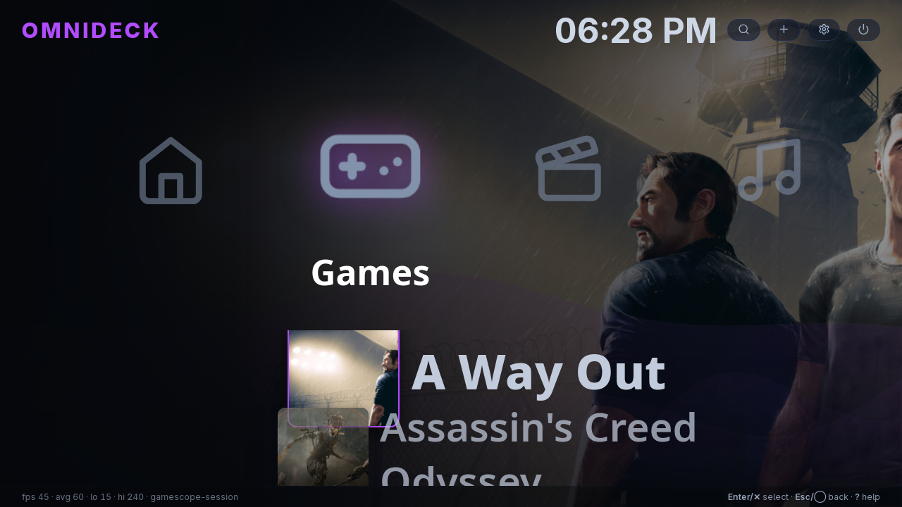
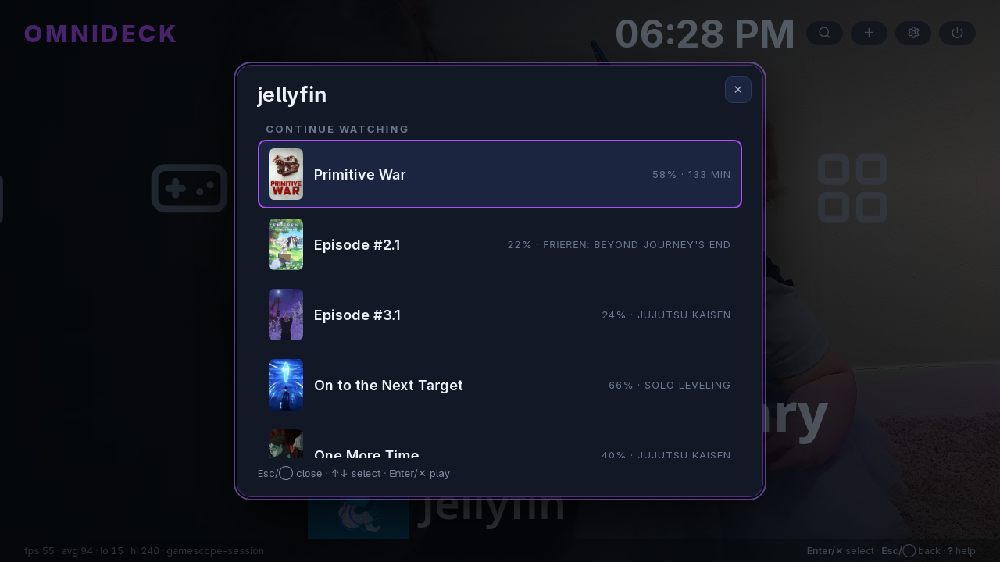

<div align="center">

# OmniDeck

**A 10-foot, controller-first media & game launcher for Linux.**

The living-room "do-it-all": games, streaming, music, and your own media — one grid,
one controller. Easy enough for anyone in the house, deep enough to make tinkerers grin.

`Tauri 2` · `Svelte 5` · `Rust` · GPL-3.0

[](https://github.com/atiner117/omnideck/actions/workflows/ci.yml)

> **v0.2.0** — session-validated on hardware: gamescope session boot, app switcher,
> global hotkeys, Jellyfin media library with mpv direct-play, AUR packaging built in CI.

</div>

<p align="center">
  
  
</p>

---

## What it is

OmniDeck is a fullscreen, gamepad-driven launcher you can point a TV + controller at and
*do everything*: launch your Steam/Heroic games, open Netflix/Disney+/Plex/Spotify, and
play your own 4K media — without touching a mouse. It runs as a proper **gamescope
session** (SteamOS/Bazzite "Game Mode" style) on capable hardware, **and** as a plain
window on the desktop, so it's useful whether you're on the couch or at your desk.

The design goal: **a beginner can use it in 30 seconds, and an expert says "woah"** —
e.g. routing your owned media through mpv with VapourSynth upscaling/interpolation
profiles when the hardware can handle it.

## What works today

- 🎮 **Steam library** — scans `libraryfolders.vdf` + appmanifests (incl. network-mounted
  libraries), launches games, sorts by name/recent.
- 🖼️ **Box art** — uses Steam's local art, with optional **SteamGridDB** fallback for
  missing covers (cached locally).
- 📺 **Media & app catalog** — auto-detects installed apps (Feishin, VLC, Spotify,
  Jellyfin, Kodi, …) and offers browser launchers for Netflix, Disney+, Max, Hulu, Prime
  Video, Crunchyroll, YouTube, Apple TV+, Plex, Tidal, Deezer, and more — enable the ones
  you want from an in-app **Add apps** screen.
- 🕹️ **Controller + keyboard navigation** — XMB-style cross (category axis + item
  cascade), focus states, hold-to-repeat, plus mouse/wheel.
- 🍿 **Jellyfin media library** — browse Continue Watching / Latest / your libraries
  (series → seasons → episodes) inside OmniDeck and **direct-play through mpv** with
  hardware decode; an existing `jellyfin-mpv-shim` pairing is adopted automatically
  (zero setup), and `[media_server] mpv_args` can reuse your mpv/VapourSynth profiles.
- 🎞️ **Auto-tuned playback profiles** — when mpv is built with VapourSynth, OmniDeck
  generates a display-aware profile set (`~/.config/omnideck/mpv-profiles/`) and uses it
  for direct-play automatically: GPU upscaling + HDR tone mapping + debanding
  (`profile=high-quality`, `vo=gpu-next`), plus motion interpolation targeting **your
  panel's real refresh rate** (read from the session's display, e.g. 165 Hz — not a
  hardcoded 60). During playback: `F1` passthrough · `F3` denoise · `F4` smooth
  (full display rate) · `F6` ultra (optical flow; deliberately targets display/2 above
  100 Hz and stays inside a per-CPU pixel-rate budget — full-rate optical flow starves
  even fast CPUs over a long movie and desyncs audio, and a 4K source can max a modest
  CPU even at 60 Hz, so ultra declines those rather than drift; `F4` still takes them to
  the full display rate). Opt out with `[media_server] auto_profiles = false`, or set `mpv_args` to use
  your own set; `omnideck mpvprofiles` renders + reports what was detected, and deleting
  the `# omnideck-generated` header line in any rendered file makes it yours to edit. For
  daily use *outside* the session (e.g. casting via jellyfin-mpv-shim, where the panel rate
  can't be auto-probed), set `[media_server] display_fps = 165.08` so the set bakes your real
  refresh instead of the 60 fallback; `audio_samplerate = 96000` forces mpv's output rate for
  a fixed-rate DAC / LDAC (both default off).
- 🃏 **App switcher, iOS-style** (session) — tap **Guide** (or `Ctrl+Alt+Home`) for a row of
  cards, one per running app: pick one to jump to it, **Select** (or the ✕) to close it,
  **B** to drop back to the dashboard. Guide-**hold** still closes everything at once.
- 🎮➡️🖱️ **Controller drives launched apps too** (session) — while a launched PWA/browser/
  app is in front, the pad becomes a virtual keyboard+mouse (`/dev/uinput`): **right stick =
  mouse pointer** (the primary way to navigate any web UI), `A`/cross = click, dpad/left
  stick = arrow keys with console-style repeat (Jellyfin-web and every TV-style UI is
  arrow-driven), `X` = Enter, `B` = Back/Esc, `Y` = play/pause, `R2` = click-and-hold,
  `L1`/`R1` = scroll — the PlayStation-browser experience. Needs your user in the `input` group.
- 🧊 **Silent hidden apps are frozen** (session) — switching away keeps *audible* apps
  running (background music is a feature), but a hidden app with no active audio stream
  is SIGSTOPped until you switch back — a hidden software-rendering PWA no longer burns
  hundreds of watts behind the dashboard.
- 🔎 **Global search** — find games & apps instantly, with a configurable web-search
  fallback (DuckDuckGo / Google / Brave / Bing, or your own SearXNG via config).
- 🌊 **Live wallpaper & ambient music** — PSP-style wave ribbons and a synthesized
  ambient pad (no bundled audio), both opt-in/out in Settings.
- ❓ **Help overlay** — the full keyboard/controller reference on `?`/F1, so the footer
  stays clean.
- ▶️ **Now Playing + exit watchdog** — launches a Steam game, watches Steam's running
  state, shows a "now playing" card, and detects when you quit back to the launcher.
- ⏻ **Power menu** — Exit / Suspend / Restart / Shut down (with confirm) via `systemctl`.
- ⭐ **Dashboard** — pinned favorites plus a configurable recently-played row.
- 🎨 **Theming** — config-driven accent color, UI scale, background blur/brightness,
  optional navigation sounds, clock.
- ⚙️ **Config** — everything lives in a hand-editable `~/.config/omnideck/config.toml`,
  also editable from an in-app preferences panel.
- 🧠 **Capability tiers** — detects the GPU and picks: gamescope session, `cage` media
  kiosk, or a plain window; auto-applies the right webview env per GPU (NVIDIA/Mesa).

## Requirements

- Linux (X11 or Wayland). A browser (Brave/Chromium/Firefox) for streaming launchers.
- Build deps: `webkit2gtk-4.1`, `libudev` (gamepad input), Rust (1.80+), Node 20+ or Bun.
- Optional: `gamescope` (for the 10-foot **session** — install it with
  `packaging/install-session.sh`, which runs a *plain* gamescope session; no
  `gamescope-session-plus` required); `cage` (media-kiosk tier on GPU-less hosts);
  `xorg-xprop` (needed inside a gamescope session). Now Playing titles come straight
  from MPRIS over D-Bus — `playerctl` is no longer needed.

  The session uses the display's EDID-*preferred* mode, which on many gaming monitors
  is 60 Hz even when the panel does 144/165. To force the real mode (and pick the right
  monitor on multi-head setups), create `~/.config/omnideck/session.conf`:

  ```bash
  GAMESCOPE_FLAGS="-W 2560 -H 1440 -r 165 -O DP-3"   # connector names: ls /sys/class/drm
  ```

## Three ways to run it

1. **Desktop window** — just run `omnideck`. A normal app window; everything works
   except the session-only pieces (app switcher, global chords).
2. **Fullscreen "Big Picture" from your desktop** — `gamescope -f -- omnideck`.
   The complete 10-foot experience (switcher, Guide button, chords, fullscreen apps)
   inside your existing desktop session, no logout. Add `-W/-H/-r` flags to taste.
   ⚠ Needs a nested-capable gamescope: on a **Wayland** desktop this just works; on an
   **X11** desktop gamescope must be built with its SDL backend — some distro builds
   (e.g. CachyOS 3.16.x) omit it and silently fall back to `headless`, i.e. OmniDeck
   runs with **no visible window**. If `gamescope` logs "Creating headless backend",
   use mode 1 or 3 instead.
3. **Dedicated session** — `sudo ./packaging/install-session.sh`, then pick
   **OmniDeck** at your display manager's session list. The console mode.

## Build & run (dev)

```bash
git clone https://github.com/atiner117/omnideck && cd omnideck
bun install
bun run tauri dev                  # development
bun run tauri build --no-bundle    # release binary -> src-tauri/target/release/omnideck
```

## Controls

| Action | Keyboard | Controller |
|--------|----------|------------|
| Navigate (category ← →, items ↑ ↓) | Arrow keys | D-pad / left stick |
| Launch / confirm | Enter | ✕ / A (South) |
| Favorite (pin to Dashboard) | `F` | □ / X (West) |
| Search | `/` | Select |
| Add apps | `A` | △ / Y (North) |
| Settings | `P` | Start / Options |
| Back / close panel / cancel | Esc | ◯ / B (East) |
| Open the app-switcher deck (session) | `Ctrl+Alt+Home` | Guide (press) |
| Close all launched apps & return (session) | `Ctrl+Alt+End` | Guide (hold ≥ 0.8 s) |

Power (Exit / Suspend / Restart / Shut down) is in the **⏻** menu in the top bar.
The deck/close rows work **while the launched app has focus** — the Guide button reads the
controller hardware directly, and the chords are global X grabs in the session. The switcher
hides apps instead of killing them: audible apps (music) keep playing in the background while
you browse, and a card brings any app back exactly where you left it.

On a controller, **Select** opens search with an **on-screen keyboard** (D-pad to move,
✕/A to type, bumpers to pick a result) — search and launch without a keyboard.

## Configuration

`~/.config/omnideck/config.toml` (or `$XDG_CONFIG_HOME/omnideck/`; generated on first run):

```toml
[settings]
grid_columns = 6
sort = "alpha"                          # alpha | recent
show_runtimes = false                   # show Proton / Steam runtimes
accent = "#b14cff"
ui_scale = "medium"                     # small | medium | large | huge | custom
ui_scale_custom = 1.6                   # multiplier used when ui_scale = "custom"
bg_blur = 0.0                           # background cover-art blur, px (0 = sharp)
bg_brightness = 0.82                    # background cover-art brightness (0.3–1.0)
sound = true                            # subtle navigation sounds
dashboard_recents = 8                   # recently-played games on Dashboard (0 = off)
search_provider = "https://duckduckgo.com/?q="   # web-search prefix (e.g. a SearXNG URL)
steamgriddb_key = ""                    # optional: free key from steamgriddb.com fills in box art

[[apps]]                                # reorder / remove / add your own tiles
name = "Big Picture"
icon = "🎮"
exec = ["steam", "steam://open/bigpicture"]
accent = "#1b2a44"
category = "games"                      # games | video | music | apps
```

Most of these are also editable in-app (**Settings**), including an **Add custom launcher**
form for your own commands.

Debug helpers (headless, no window): `omnideck probe`, `scan`, `config`,
`catalog`, `gridart <appid>`, `media`, `mediasrv`, `mpvprofiles`
(and `omnideck --help` / `--version`).

## A note on streaming quality

Commercial streaming on Linux uses Widevine **L3** (software DRM), so Netflix is capped at
**720p** and most services at **~1080p** — **4K is not possible** in a Linux browser. Your
**own** media (Plex/Jellyfin/mpv) plays at full quality including 4K, which is exactly
where OmniDeck's media tuning shines.

## Roadmap

- ✅ Real gamescope **session boot** validated on NVIDIA hardware (M2, 2026-07-02: boots from
  SDDM, renders, keyboard input + app launch work — full A–E matrix in `packaging/M2-RESULTS.md`)
- App/streaming **icons** (favicons + bundled icon set) for non-game tiles
- Native/flatpak catalog expansion (verified Flathub IDs)
- **Packaging** (AUR, Flatpak, AppImage)
- Heroic/Lutris/emulator game sources; auto display-resolution scaling
- Eventually a cut-down **Windows** build (windowed launcher; no gamescope session)

## Contributing

See [CONTRIBUTING.md](CONTRIBUTING.md). Contributions are under GPL-3.0-or-later.

## License

[GPL-3.0-or-later](LICENSE) © OmniDeck contributors.
